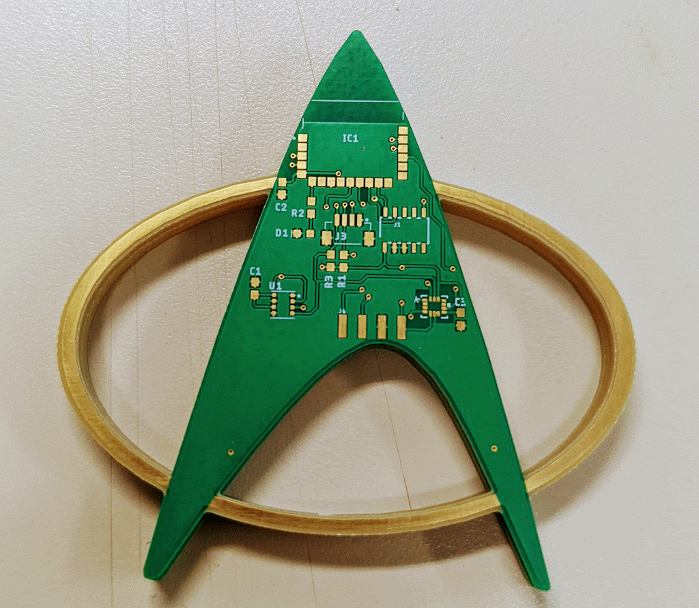

# Bluetooth Communicator Badge

This project is my submission for the [Hackaday Sci-Fi Contest](https://hackaday.io/contest/184314-sci-fi-contest). It is a communicator badge from Star Trek. 

It consists of the following components:
1. [BlueNRG-M2SP](https://www.mouser.com/ProductDetail/STMicroelectronics/BLUENRG-M2SP?qs=%252B6g0mu59x7IAMQd6TX9bOA%3D%3D)
2. [BME680](https://www.digikey.com/en/products/detail/bosch-sensortec/BME680/7401317)
3. [LSM6DSO32](https://www.st.com/resource/en/datasheet/lsm6dso32.pdf)

This board can serve two purposes namely: 
1. Pedometer
2. Air Quality Communicator

The first version of the board: 

